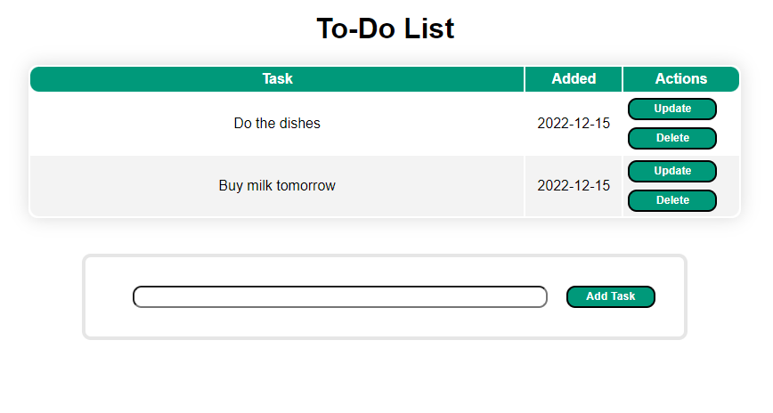

# To-Do List Application

A simple web-based To-Do list application built with Flask and SQLAlchemy.



## Features

*   **Add new tasks:** Quickly add new tasks to your to-do list.
*   **View all tasks:** See a list of all your tasks.
*   **Update existing tasks:** Edit the content of your tasks.
*   **Delete tasks:** Remove tasks from your list.

## Dependencies

The application requires the following Python packages:

*   Click==7.0
*   Flask==1.1.2
*   Flask-SQLAlchemy==2.4.4
*   gunicorn==19.9.0
*   itsdangerous==1.1.0
*   Jinja2==2.11.3
*   MarkupSafe==1.1.1
*   SQLAlchemy==1.3.22
*   Werkzeug==1.0.1

## Installation

1.  **Create a virtual environment and install dependencies:**
    ```bash
    uv venv
    uv sync
    ```

## Usage

1.  **Run the application:**
    ```bash
    uv run -m todolist.app
    ```

2.  **Open your web browser and go to:**
    ```
    http://127.0.0.1:5000/
    ```

You can now add, view, update, and delete your tasks.

### Install using PyApp

### Build
```bash
uv run -m build
```

### Get PyApp (https://ofek.dev/pyapp/latest/)

```bash
export PYAPP_PROJECT_NAME="todolist"
export PYAPP_PROJECT_PATH="/Users/manoj/Github/ToDoList/dist/todolist-0.1.0-py3-none-any.whl"
export PYAPP_PROJECT_VERSION="0.1.0"
export PYAPP_EXEC_SCRIPT="/Users/manoj/Github/ToDoList/todolist/app.py"

cargo build --release
mv target/release/pyapp todolist && chmod +x todolist
./todolist
```